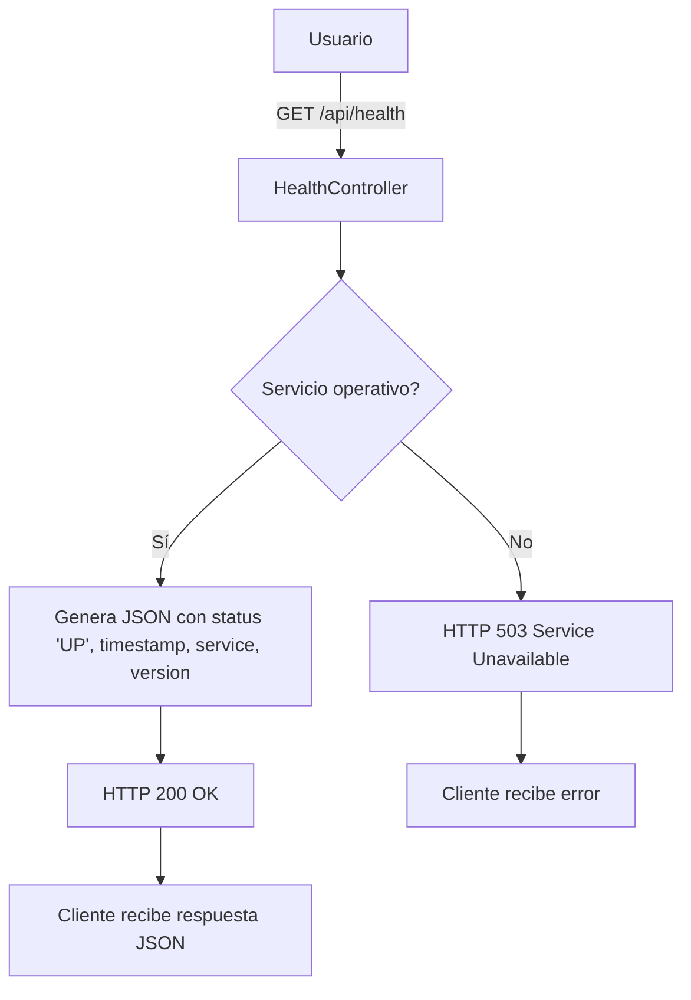

# HealthController - CI/CD Pipeline PoC

Este archivo describe el funcionamiento del controlador de salud (`HealthController`) del microservicio de la PoC del pipeline.

## Endpoints principales

- **GET `/api/health`**
  - Devuelve el estado de salud del servicio en formato JSON.
  - Ejemplo de respuesta:
    ```json
    {
      "status": "UP",
      "timestamp": "2025-10-15T12:34:56.789",
      "service": "cicd-pipeline-poc-app",
      "version": "1.0.0"
    }
    ```

- **GET `/api/health/status`**
  - Devuelve un mensaje de texto plano con el estado y la fecha actual.
  - Ejemplo: `Service is running smoothy. Date: 15/10/2025`

- **GET `/api/status`**
  - Devuelve un mensaje simple: `Service is running smoothly.`

- **GET `/api/info`**
  - Devuelve información de la aplicación y vulnerabilidades intencionales para pruebas de seguridad.

## Diagrama de funcionamiento



## Notas
- El endpoint `/api/health` cumple con los criterios de aceptación de monitoreo y readiness.
- El código fuente se encuentra en `microservice-moc-app/src/main/java/com/cicd/pipeline/poc/controller/HealthController.java`.
